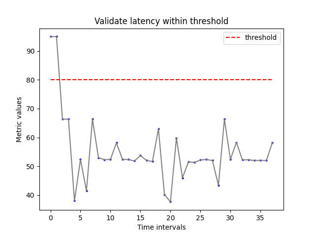
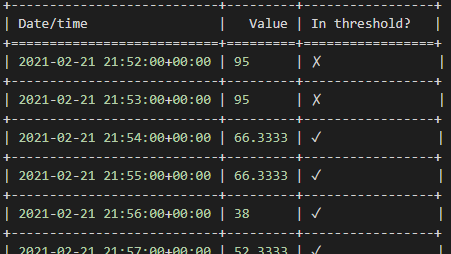

# GitHub Action for validating if Azure monitor metrics are within threshold

Validate if the azure monitor metrics for a Azure resource is within a given threshold. For example, you can validate if CPU utilization is less that 80% or the number of HTTP HTTP errors 4xx, 5xx) is less than a given threshold (say 10) in a given timeframe (say past 2 hours). If the threshold is breached, the action will fail, threreby breaking your release pipeline that uses this action. This action will be __useful for CI/CD workflows__ where metrics can be used a validation gate.

__Note:__ You can use any metric that your Azure resource reports to Azure monitor(e.g. CPUUtilization, MemoryUtilization etc). As an example, the metrics that Azure ML's Managed endpoint supports are [here](https://docs.microsoft.com/en-us/azure/machine-learning/how-to-monitor-online-endpoints)

## Usage

Using the below example you can check if the request latency metric is less than 80 milliseconds for a given timeframe for a given resource. If the condition is not met, the action will fail. You can use more complex filter conditions (see docs below).


```yaml
- name: Test request latency within threshold
  uses: rsethur/validate-metrics@v1    
  with:
      #resource id of the resource for which you want to validate the metrics. Below is an e.g. of Azure ML MAnaged endpoints
      resource_id: /subscriptions/xxxx/resourceGroups/xx/providers/Microsoft.MachineLearningServices/workspaces/xx/onlineEndpoints/xx/deployments/blue
      # metric you want to validate
      metric: RequestLatency_P90
      # which aggregation of the metric you would like to compare (in this case Average)
      aggregation: Average
      # what is the metrics condition to compare with threshold. In the below case it is "lesser than equal to"
      metrics_condition: lte
      # what interval you want the metrics data for. In the below case it is 1 minute
      interval: PT1M
      # start & end time (see inputs section in this doc below for details on format)
      start_time: "02-21-2021 21:52:00"
      end_time: "02-21-2021 22:30:00"
      # what is the threshold value you want to compare each of the metric values against
      threshold: 80
      # (optional) name of the chart (PNG file will be created)
      chart_name: "Validate latency within threshold"
      # (optional) which path to store the chart
      chart_save_path: "/home/runner/chart-output/validate-latency" 
  env:
      AZURE_CREDENTIALS: ${{secrets.AZURE_CREDENTIALS}}

# [Optional] Upload the chart as an artifact to the workflow run
- uses: actions/upload-artifact@v2
  with:
    name: validate-memory-chart
    path: "/home/runner/chart-output/validate-latency" 
```

This action validates if your threshold conditions are met and optionally generates a chart. You can see from the chart that the threshold was breached


This action also outputs a table in the workflow run output showing the metric values in the various time intervals and if the threshold was breached. Example output for the above:



## Prerequsites
1. In your github action parent workflow, python needs to be installed. Example:
```yaml
- name: Setup Python
  uses: actions/setup-python@v2.1.4
  with:
    python-version: 3.7
```

2. Create a secret called AZURE_CREDENTIALS following the instructions [here](https://github.com/marketplace/actions/azure-login#configure-deployment-credentials).

## Authentication credentials input for the action
The action support both service principal auth and CLI auth

    a. To use service principal pass the AZURE_CREDENTIALS as an environment variable to the action (like in the example in the top).
    
    b. If you want to use CLI auth, perform cli auth in your workflow before using this action. example
    ```yaml
    - name: azure login
      uses: azure/login@v1
      with:
        creds: ${{secrets.AZURE_CREDENTIALS}}
        
    - name: Set defaults
      run: |
        # If you are using azure ml, then set azure ml workspace name
        az config set defaults.workspace=<my-workspace-name>
        # set default resource group
        az config set defaults.group=<my-rg>
        #set default subs
        az account set -s <my-subs-id>
    ```

You can see examples of both of the above options in the [integration test workflow](.github/workflows/integration-test.yml)

## Inputs reference

| Input | Required | Default | Description |
| ----- | -------- | ------- | ----------- |
| metric | Y | - | name of the azure monitor metric you want to validate. e.g. MemoryUtilization |
| aggregation | Y | - | type of aggregation. Typical supported ones by the resources: Average, Maximum, Minimum |
| metrics_condition | Y | - | condition to compare metrics value and threshold, allowed lte (less than equals) and gte (greater than equals) |
| interval | Y | PT1M | supported intervals will be in format e.g. for minutes: PT1M, for hours: PT12H,for day: P1D. More examples [here](https://docs.microsoft.com/en-us/rest/api/monitor/metricdefinitions/list) |
| threshold | Y | - | threshold value to compare the metric with (a number) |
| resource_id | Y | - |    description: arm resource id of the resource |
| start_time | - | - | date time in ISO 8601 format (default in UTC timezone) e.g 02-21-2021 21:14:00 |
| end_time | - | - | date time in ISO 8601 format (default in UTC timezone) e.g 02-21-2021 21:14:00 |
| filter | - | - | Azure monitor chart filter condition. e.g.: deployment eq 'blue' and statusCodeClass ne '2xx'. For more information on filter syntax refer [here]( https://docs.microsoft.com/en-us/rest/api/monitor/metrics/list) |
| num_intervals | - | - | required only when start and end date not provided. The metrics are retrieived for num_intervals time from current time. For e.g. if interval is PT1M and num_intervals is 5, then 5 metric values are pulled. |
| allow_empty_metrics | - | False | if False will throw error incase metrics are not available for the given duration |
| chart_name | - | chart | file name for chart to save |
| chart_save_path  | - | chart_output  | path to save charts |

## Environment variables reference
| Input | Required | Default | Description |
| ----- | -------- | ------- | ----------- |
| AZURE_CREDENTIALS | - | - | Needed if you want the action to use service principal authentication instead of CLI auth. First create a secret called AZURE_CREDENTIALS following the instructions [here](https://github.com/marketplace/actions/azure-login#configure-deployment-credentials). Then pass the AZURE_CREDENTIALS as an environment variable to the action |